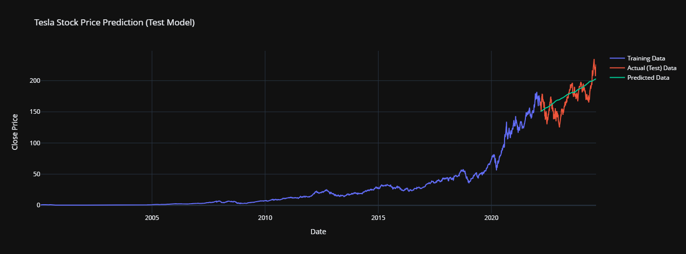

# Prophet-Stock-Prize-Predictor
This Streamlit app leverages Facebook Prophet to analyze and predict stock prices. Explore interactive visualizations of historical prices, technical indicators, and trading volume, and generate future price forecasts with confidence intervals. Stay informed with integrated stock-specific news from Google News.

# Advanced Stock Price Predictor using Streamlit and Prophet

This project is an interactive web application built with Streamlit that predicts stock prices using time series forecasting model Prophet developed by META, including an enhanced Prophet model. It provides users with comprehensive tools to:

- **Prophet:** It uses robust time series forecasting model developed by Meta.
- **Predict future stock prices:** Generate forecasts for user-selected stocks and time horizons.
- **Explore historical stock data:** Visualize stock price history, technical indicators, and trading volume using interactive charts and tables.
- **Stay informed with latest news:** Get the latest stock-related news from Google News.

## Features

- **Prophet:** It uses robust time series forecasting model developed by Meta.

- **Technical Indicators:**  Calculates and displays:
    - Simple Moving Average (SMA)
    - Exponential Moving Average (EMA)
    - Relative Strength Index (RSI)
    - Bollinger Bands 
- **Enhanced Prophet Model:** 
    - Includes additional regressors (technical indicators, lagged features) for potentially better accuracy.
    - Allows for easy customization of Prophet parameters.
- **Cross-Validation:** Evaluate model performance using time series cross-validation.
- **Interactive Visualizations:** 
    - Price history chart with moving averages and standard deviation.
    - OHLC (candlestick) chart.
    - Technical indicators plot (SMA, EMA, Bollinger Bands, RSI).
    - Volume analysis chart.
    - Daily returns distribution histogram.
    - Moving averages chart (50-day and 200-day SMA).
    - Correlation heatmap.
    - Price volatility chart.
    - Forecast component breakdown.
- **Data Exploration:** 
    - Displays stock data summary statistics.
    - Provides a table view of historical data.
    - Offers CSV download options for stock data, cross-validation results, and predictions.
- **News Integration:**  Fetches the latest news headlines related to the selected stock.

## Interactive Visual Graphs and Data Analysis
Our application offers a rich set of interactive visual graphs and data analysis tools to help users gain deep insights into stock performance and predictions. Here's a glimpse of what you can expect:

**Long-term Stock Price Prediction:**
Users can generate and visualize long-term stock price predictions, such as the next 3 years for Apple stock. This forecast includes confidence intervals to give a range of potential outcomes.
Technical Indicators Analysis:
Explore the relationship between various technical indicators and stock performance. For instance, you can view the RSI (Relative Strength Index) plotted against the date to identify potential overbought or oversold conditions.
-**Comprehensive Technical Analysis:**
Our app provides a comprehensive view of multiple technical indicators on a single chart. This includes Moving Averages, Bollinger Bands, and more, allowing for a holistic analysis of stock trends and patterns.


-**Correlation Heatmap:**
Visualize the correlations between different aspects of stock data using an interactive heatmap. This can reveal interesting relationships between various financial metrics.


-**Stock Price with Moving Averages and Bollinger Bands:**
Get a clear picture of stock price movements along with key technical indicators like moving averages and Bollinger Bands. This can help in identifying trends and potential price reversals.


-**Model Performance Visualization:**
Compare predicted data against actual test data to evaluate the model's performance. This visual representation helps in understanding the accuracy of our predictions.

**Model Performence**


**Apple Stock Prize Prediction for next 3 years**


**Data Visualizations**


These interactive visualizations allow users to zoom in, pan, and hover over data points for detailed information. By leveraging these tools, users can conduct in-depth analysis and make more informed decisions about their stock investments.

## Getting Started

1. **Clone the Repository:**
   ```bash
   git clone https://github.com/jayash1973/Prophet-Stock-Prize-Predictor.git
   ```

2. **Install Dependencies:**
   ```bash
   pip install -r requirements.txt
   ```

3. **Run the Application:**
   ```bash
   streamlit run app.py
   ```

4. **Understanding the Prophet model**
    Use the file `prediction.ipynb` to see how the Prophet model works in detail.
## Usage

- **Select App Mode:** Choose from "Test Model", "Predict Stock Prices", or "Explore Data".
- **Select Company:**  Choose a stock from the provided list of 150 companies.
- **Adjust Parameters:**  Fine-tune model parameters and forecasting horizons as needed.
- **Interact with Visualizations:** Use the zoom, pan, hover, and legend controls to analyze the charts effectively.
- **Stay Updated:** Read the latest news related to your selected stock.

## Live Demo

You can test this project live at: [https://huggingface.co/spaces/Johan713/Prophet](https://huggingface.co/spaces/Johan713/Prophet?logs=container)

## Contributing

Contributions are welcome! Feel free to open issues or pull requests.

## License

This project is licensed under the MIT License.

## Contact Details

**Jayash Bhardwaj**

[](https://github.com/jayash1973)
[](https://www.linkedin.com/in/jayash-bhardwaj)
